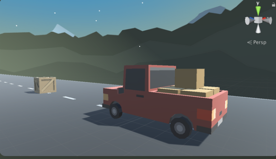

# Overview

In this lesson we will see how to gain control of the vehicle. To do this we detect when the player is pressing the arrow keys, then accelerate and turn the vehicle based on those inputs. Using new methods, Vectors, and variables, you will make the vehicle move forwards or backwards and turn left to right.

<!-- Don't edit links here, change them in _data/assignment.yml instead, -->

[slides]: <{{site.data.assignment.slides}}>
[template]: <{{site.data.assignment.template}}>
